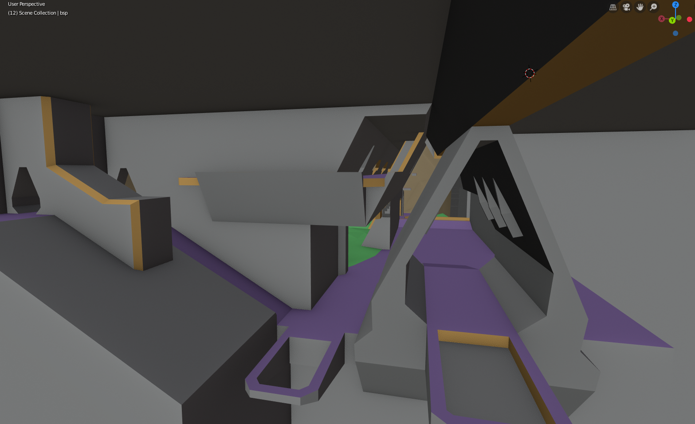

# Alpine

This repo contains the source for my Halo CE map, working title _Alpine_. The map is still a work in progress.

## Design
_Alpine_ is intended to be a semi-symmetric mixed indoor-outdoor map and takes inspiration from a variety of other Halo multiplayer maps and campaign levels:

* The Silent Cartographer (b30)
* Halo (a30)
* Sacred Icon
* Relic
* Hang 'Em High
* [Mudslide](http://hce.halomaps.org/index.cfm?fid=528)
* [Portent](http://hce.halomaps.org/index.cfm?fid=1796)
