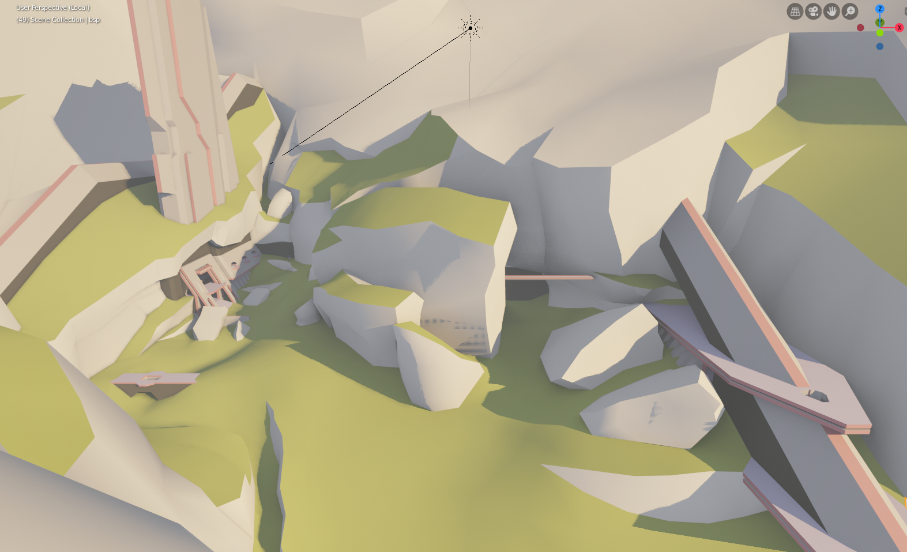
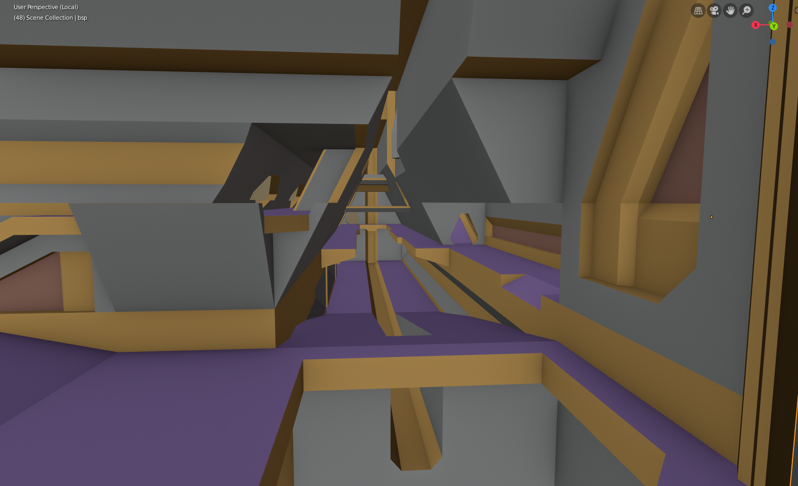

# Alpine

This repo contains the sources and build automation for my Halo CE map, working title _Alpine_. The map is still a work in progress:




## Design

_Alpine_ is intended to be a semi-symmetric mixed indoor-outdoor map and takes inspiration from a variety of other Halo multiplayer maps and campaign levels:

* The Silent Cartographer (b30)
* Halo (a30)
* Sacred Icon
* Valhalla
* Longest
* Relic
* Hang 'Em High
* [Mudslide](http://hce.halomaps.org/index.cfm?fid=528)
* [Portent](http://hce.halomaps.org/index.cfm?fid=1796)

## Building the map

At a high level, Halo CE maps are built in a multi-step iterative process:

1. Source content creation using 2D and 3D software
2. Creation and editing of tags, Halo's binary representation of map data
3. Compilation of a distributable _.map_ cache file

Halo CE maps are traditional built using the Halo Editing Kit (HEK), Photoshop, and 3ds Max on Windows. However, in this project I am attempting to take advantage of modern community-maintained tools when possible and the following instructions will follow my Linux-based workflow. This is an experiment in automation.

## Content creation
### Level geometry

The map's level geometry is authored in [Blender][2] and exported using [Project Cartographer's JMS exporter][1] (be sure to use latest version). It can be found in `data/levels/alpine/models/alpine.blend`. The scene uses default units, with the view's clip range set to 100-100,000. It contains the following objects:

* **frame**: Only children of this reference frame are exported to the JMS file
  * **bsp**: Main level geometry
* **bits**: Some extra geometry that might be used later, but shouldn't be included in the export
* **sun**: Approximate sunlight direction, used for prototyping lighting and shadows. Put Blender in rendered view mode for a preview

Before exporting, ensure all mesh modifiers have the "Realtime" setting enabled (so they take effect during export) and that any changes are saved. You can then run a script to automatically export to JMS, compile the structure, and run lightmaps on it:

```sh
export WINEPREFIX=<path to wine prefix for Halo and the HEK>
export HALO_HOME=<path to Halo installation within the prefix>
export JMS_EXPORTER=<path to Blend2Halo2-JMS.py>

./compile_bsp.sh
```

### Textures (todo)

Texture sources are .TIFF files, which can be edited in 2D graphics software like Photoshop or [GIMP][7]. There is no need for layers to be flattened, but some textures have an alpha channel which serve a purpose in their corresponding shader tags. Texture and UV work for this map has not begun yet since I'm still iterating on the geometry.

### Tag creation
#### Base tagset

Firstly, a base tagset needs to be setup. I am using the stock CE tagset overlaid with some of the [Refined project tags][9]. The downloading and unpacking of these tags into the `tags` directory is automated by running `./build_base_tagset.sh`. Note this requires installing `rsync`, `wget`, and `p7zip` packages.

#### Map tagset (todo)

Map-specific tags will be built using `build_alpine_tagset.sh`, which for now is just a clipboard to keep common commands. I plan to make use of a few different tools:

* [Invader][4]: Replaces the HEK's Tool (mostly). Can be installed from the AUR or built, [see docs][10]
* [Reclaimer][5]: Declaratively generate some tag data? Installed with `pip install --user -r requirements.txt`
* [Halo Editing Kit][6]: Needed to generate tags like .gbxmodel and .scenario_structure_bsp, and run radiosity

I am aiming to avoid the HEK when possible since it's known to be buggy and produce undefined behaviour ingame, which goes against the ideals of repeatable and correct automation. It also seems like the HEK will be unable to target MCC (assuming MCC custom maps are even supported).

#### Lightmaps, scenery placement (todo)

Lightmaps can be generated using Tool or Sapien, and scenery (plus vehicles, spawns, netgame flags, etc) must be placed in Sapien as described in the [HEK tutorial][8].

Theoretically these tasks could also be done from within Blender with some yet-to-be-built tooling.

## Todo

* Finish modeling the map
* UV mapping
* Create custom textures
* Portals
* Try to automate shader and other tag creation using YAML and reclaimer, Blender plugin updates
* Make a custom skybox
* Playtesting
* Look into cross-platform task runners like [DoIt][3]

## Thanks

Thank you to the following folks who helped with tools and advice on this map:

* General_101
* Anthony
* Kavawuvi
* Shelly
* Mack_Of_Trades69
* MosesOfEgypt

## License
This map and its sources are shared under [CC BY-SA 2.0](https://creativecommons.org/licenses/by-sa/2.0/). Feel free to remix or redistribute for any purpose as long as there's attribution and your derivatives are shared under the same license.


[1]: https://github.com/Project-Cartographer/H2V-Blender-JMSv2-Exporter
[2]: https://www.blender.org/
[3]: https://pydoit.org/
[4]: https://github.com/Kavawuvi/invader
[5]: https://github.com/Sigmmma/reclaimer
[6]: http://hce.halomaps.org/index.cfm?fid=411
[7]: https://www.gimp.org/
[8]: http://hce.halomaps.org/hek/
[9]: https://www.reddit.com/r/HaloCERefined/
[10]: https://invader.opencarnage.net/
